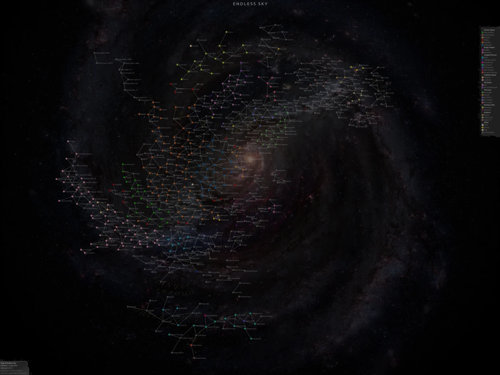
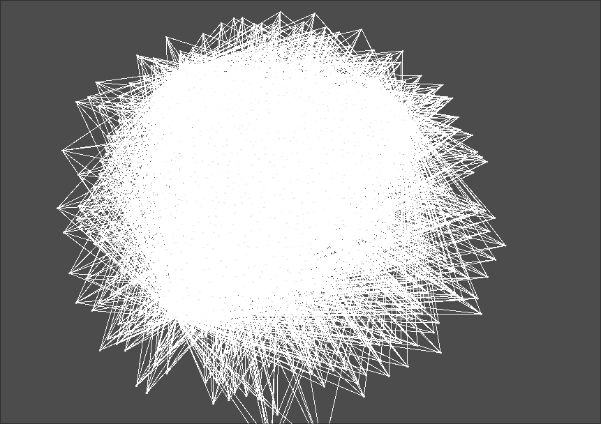
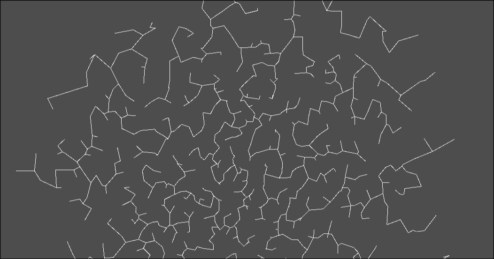
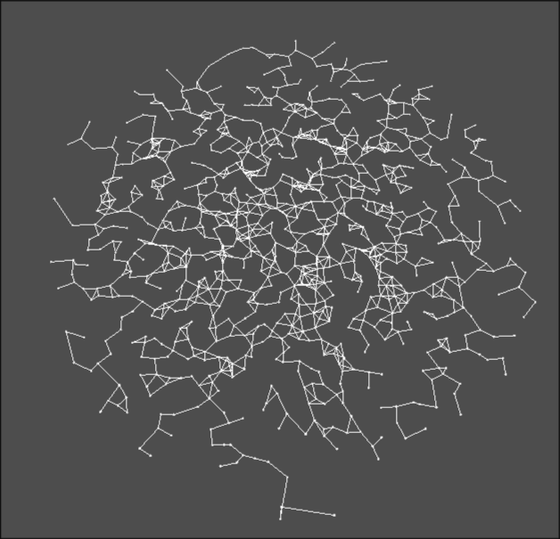
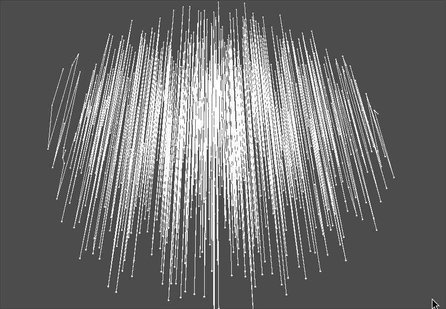

I'm currently working on a video game inspired by games like Endless Sky and Stellaris. These games both feature a "star map" of different systems with connections that the player can travel along. Endless Sky has a premade starmap that matches the vibe of what I want, but Stellaris procedurally generates it's star map for each game you play, which is the approach I want to take.

<!-- truncate -->

<ImageCaption>The star map from Endless Sky. [Source](https://endless-sky.fandom.com/wiki/Star_Map_Regions_%26_Labels)</ImageCaption>

Placing random points on a map and connecting them is easy, but it doesn't look good without some fine tuning, and there's no gaurantee that you can reach every system from every other system. I needed to come up with a more complex solution that solved two problems:
1. Each system has to be connected, so you can travel between any two systems.
2. Systems need to be connected in a way that looks visually pleasing (i.e. close systems are connected together, and there shouldn't be too many overlapping connections).


<ImageCaption>And if you accidentally connect too many systems at random, you just get a pile of uncooked spaghetti.</ImageCaption>

The first problem to solve was making sure every system was connected. This sounds simple at first, just travel along the connections until you've touched every connected system, and check if the other system is in that list.

```gdscript title="Naive method"
# I didn't actually try this
# This code is just to demonstrate how slow this method would be

func check_connection(system_a, system_b, checked_systems=[]):
    for connection in system_a.connections:
        if connection in checked_systems:
            return false
        elif connection == system_b:
            return true
        else:
            var new_checked_systems = checked_systems.append(connection)
            if check_connection(connection, system_b):
                return true
    return false
```

This might work fine for a few systems, but once you scale up to a few hundred or thousand, it starts to slow down significantly. Instead, I used a tree data structure to keep track of which systems are connected. Whenever two systems are connected, their trees are merged. Then, to check if the systems are connected, we can just see if they share the same root node by following the parents up the tree. This is much faster than checking ever single connection to see if it contains the other system we are looking for.

```gdscript title="Tree method"
class_name TreeNode extends RefCounted

var element: Variant
var parent: TreeNode = null
var children: Array[TreeNode]
var size: int = 1

# I implemented a simple cache for the root node for a small speedup here as well.
var _cached_root = null
var _cached_root_valid = false

func _init(elem: Variant):
	element = elem

func get_root():
	if parent == null:
		return self
	else:
		if _cached_root_valid:
			return _cached_root
		else:
			var root = parent.get_root()
			_cached_root = root
			_cached_root_valid = true
			return root

func get_descendents():
	var descendants = []
	for child in children:
		descendants.append(child)
		descendants.append_array(child.get_descendents())
	return descendants

static func nodes_share_root(a: TreeNode, b: TreeNode):
	return a.get_root() == b.get_root()

static func merge(a: TreeNode, b: TreeNode):
	var a_root = a.get_root()
	var b_root = b.get_root()
	if a_root != b_root:
		if (a_root.size < b_root.size):
			a_root.parent = b_root
			b_root.children.append(a_root)
			b_root.size += a_root.size
			for descendent in a_root.get_descendents():
				descendent._cached_root_valid = false
		else:
			b_root.parent = a_root
			a_root.children.append(b_root)
			a_root.size += b_root.size
			for descendent in b_root.get_descendents():
				descendent._cached_root_valid = false
```

Now checking if two systems are connected is fast, but how do we decide which systems to connect? The method I ended up using was to select a primary system (It doesn't really matter which node it is). Then, I iterate over every system and check if it's connected to the primary system. If it isn't, I get the closest system that isn't already connected, and connect it. Repeat this until every systems is connected, and then you have a nice starting point for the star map.



Much better, now each node is connected in a nice pattern. Now I connected some more nodes based on distance (with a little RNG to keep it from being too uniform) and I got this nice looking star map!



Now it's starting to look like a star map! But we have a new problem. It's still slow. Looking at the profiler reveals that repeatedly calculating the distance between every system takes... a while. The solution? Caching helps somewhat, it halved the number of times I was calculating the distance between each pair of systems. But calculating the distances one by one is still slow, if only there were a way to do all of them at once...

```glsl title="A way to do all of them at once"
#[compute]
#version 450

layout(local_size_x=10,local_size_y=10,local_size_z=1) in;

layout(set=0, binding=0, std430) restrict readonly buffer process_parameters {
    float system_count;
}
params;

layout(set=0, binding=1, std430) restrict readonly buffer system_positions {
    vec2 data[];
}
positions;


layout(set=0, binding=2, std430) restrict writeonly buffer system_distances {
    float data[];
}
distances;

void main() {
    vec2 pos1 = positions.data[gl_GlobalInvocationID.x];
    vec2 pos2 = positions.data[gl_GlobalInvocationID.y];
    float dist = distance(pos1, pos2);
    int index = int(gl_GlobalInvocationID.x + (gl_GlobalInvocationID.y * params.system_count));
    distances.data[index] = dist;
}
```

Compute shaders! GPUs are pretty good at doing lots of vector math at once, so we can use a compute shader to calculate every single distance beforehand on the gpu, and just read from an array of the stored distances. The compute shader works by first specifying the workgroup size, and then defining the buffers for the shader. I used 3 buffers: params, which just contains the total number of systems, positions, which is an array of all the positions of the systems, and distances, which is an array of the results. I hadn't made a compute shader before, and my only experience with shaders was with Godot's shader lanuage, but it was fairly easy to get it to work once I got the buffers figured out.


<ImageCaption>Here I messed up the buffer by excluding the Y values somehow, leading to to this interesting pattern.</ImageCaption>

I also achieved a minor performance boost by assigning each system an ID and accessing the array using that instead of using the system object directly, which avoided some internal conversion. Perhaps some of these optimizations are a little preemptive, but until I come up with a solution for serializing and deserializing a star map, minimizing generation time will help speed up other aspects of game development. Additionally, I don't expect to change this aspect of the game much at all, it fits my vision pretty well, and may only require some parameter tweaks between here in the final product.

Finally, there are still further optimizations I could make to the process. Right now a lot of the generation happens on a single thread, but I think a lot of it could easily be modified to be multithreaded, since many of the operations aren't sequential in nature. Additionally, the way I'm getting an array of the closest systems to another system is by sorting all of the systems by their distance. I could definitely speed this up by finding the first N closest systems, and only sorting those instead of sorting all of them, since I will likely only need the first 5 or 10 closest systems at most.
