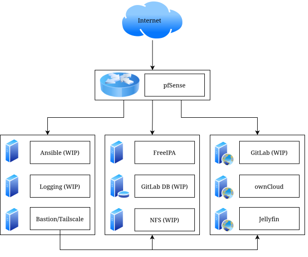

Last summer, I started building a home cyber lab to get hands-on sysadmin and networking experience before transferring to UTSA, and it quickly became my best learning environment for Linux administration and security tooling.

<!-- truncate -->
## Initial Setup

Designing my lab began with identifying the hardware that I would be running the lab on. I did not want to use a cloud provider for a couple of reasons: I didn't want to be actively paying for a subscription to run the lab, and I wanted to get hands-on experience with physical server hardware. I decided to purchase a refurbished Dell PowerEdge R630, a rack server with 128 GB of ram and more cores than I could ever need. 

It was probably not the most effective purchase I could have made - I had an old computer that would have worked just fine - but again, I wanted to have a hands-on experience with server hardware. And it came with an added bonus, it shipped with a tool called Integrated Dell Remote Access Control (iDRAC), which enables remote access to the entire system including the BIOS through a web console. That means if the OS fails to boot, I can still access the BIOS and monitor the hardware remotely.

<ImageCaption>Dell PowerEdge R630. A full rack server was probably overkill.</ImageCaption>

Once I had decided on the lab hardware, I needed to decide on the software. I saw Proxmox frequently mentioned online as a commonly used hypervisor, and it had a built-in web interface that simplified setting up and managing virtual machines. Because it was so popular there were also a wide variety of community projects that supported it, which was another advantage it held.

One of those projects was a website called [Proxmox VE Helper-Scripts](https://community-scripts.github.io/ProxmoxVE/). It has a large collection of community-made scripts that can automatically install and configure containers and virtual machines. Using these scripts, while it didn't teach me much about system administration, did help me to understand the Proxmox interface and get acquainted with managing virtual machines. I used the scripts to set up a few containers that I thought would be helpful, including Gitea to host my code projects, and Tailscale as a proxy to remotely access the server from outside my home. But, this wasn't teaching me everything I wanted to learn, so I began to move away from using the scripts.

## Learning What the Scripts Hide

While the install scripts were an easy and convenient way to set up a service, they had some disadvantages. While all the scripts were publicly available on Github, I wasn't manually reviewing the code for each of the scripts, so I had no way of knowing if they were safe to use - not good security practice. Additionally, some of the scripts had limitations or configurations that I wasn't familiar with. The Gitea install script, for example, only worked on an Alpine Linux container, which was a distro I was unfamiliar with.

Once I began my first semester at UTSA in the Fall, I also began attending UTSA's practices for CCDC: the Collegiate Cyber Defense Competition. At these practices I began to learn a lot very quickly about how to manage Linux systems. We did several practices learning to set up a variety of services: bind9, nginx, apache, et cetera. I was learning a lot very quickly, and I took what I was learning and implemented it back into my lab.

An example of this was nginx. I created a container and installed nginx on it to use as a reverse proxy. This allowed me to route the traffic from all my services through one machine, and change which one I accessed based on the URL. To set up the DNS records for that, I used bind9. Finally, I set up pfSense to act as a firewall/router, and port forwarded the proxy through pfSense. This was the beginning of my lab starting to resemble a real network.

## From Deployment to Administration

To learn more about administering user accounts, I wanted to set up a domain controller. This would also have the benefit of being able to use the same account across multiple machines. Seeing as I was primarily using Linux systems, I decided to set up FreeIPA, which provides a web interface for managing LDAP users, and other features like Kerberos authentication and DNS.

I ran into a lot of issues setting up FreeIPA. It does not play well with containers. FreeIPA assigns users IDs within a random range that is generally very high. The reason for this is that it allows two FreeIPA instances to more easily merge if two companies were to merge. However the issue is that by default, containers only support up user IDs up to 10,000. You can get around this by adding more user ID mappings in the container's config, but you have to do it for each container, and I also am generally unfamiliar with how ID mappings work and I didn't want to do something that would cause a security hole or break something.

I ended up switching from bind9's DNS to FreeIPA's DNS. FreeIPA has a web interface to manage the records, and you can automatically add records for a machine based on its hostname when enrolling it into the network. I also set up ownCloud Infinite Scale, which is a file sharing interface. It has support to bind logins to LDAP, so I can use FreeIPA to create accounts for it.

<ImageCaption>The network map of the most recent iteration of my lab.</ImageCaption>

Most recently, I've begun the process of switching over to a segmented network design. I kept seeing segmented networks in CCDC practice, and they seem to have some added security benefits. You can decrease the attack surface of your machines, restrict the lateral movement of attackers, and isolate breaches to specific areas. I also learned about jump box or bastion host, which is essentially a machine that is a single dedicated SSH box. This way you can only allow SSH traffic in and out of the network through the bastion host, and keep it as up to date as possible to minimize vulnerabilities.

## Future Goals

There's still a lot I want to work on with my lab.

- I want to finish migrating from Gitea to GitLab, so that I can experiment with setting up runners and the security challenges that come with having a machine that automatically runs software on ever-changing code. 
- I want to set up FreeIPA automount so home directories persist across machines.
- I want to set up Elastic, Logstash, and Kibana (ELK stack). I had a great time using Kibana during TracerFIRE 14.
- I already have a machine running Ansible on my lab, but I need to learn how to make playbooks to simplify updating and enrolling machines.
- I'd also like to build my knowledge of Windows machines more, so I'll have to experiment with setting up a Windows domain controller. I'd also like to look into setting up cross-trust between Active Directory and FreeIPA.
